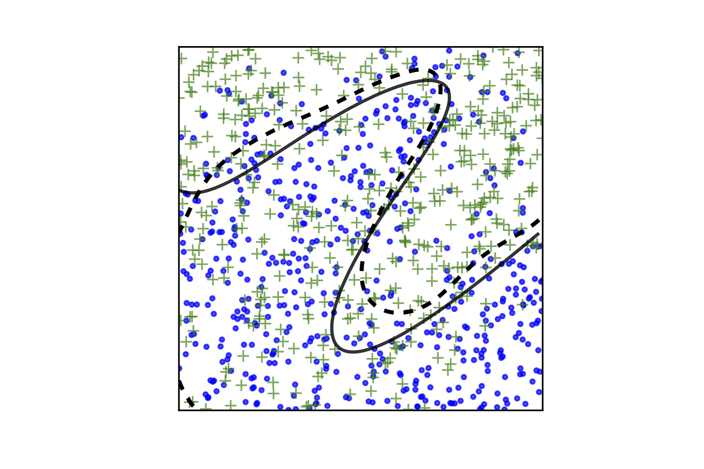

**Abstract**

The machine learning bubble may be overinflated, but it is not about to burst. Interdisciplinary research in this field is grounded in sound theory [3, 7, 10] and has numerous empirical breakthroughs to show for. As it finds more and more applications and concentrates public research funding, many of us are still wondering: how can mathematics contribute? 

Case study of an interaction between elementary topology and machine learning's binary classification problem. Following classical theorems, we obtain a topologically accurate solution. 

# 1. The problem

Recall the Jordan curve theorem: *a simple closed curve $\gamma$ separates the plane in two connected components, one of which is bounded* [5, 6]. Now suppose the curve is hidden from us, but that we are given a random sample $(x_1, x_2, \dots, x_n)$ from the square $[0,1]^2$ together with labels $(\ell_1, \ell_2, \dots, \ell_n)\in \{0,1\}^n$. We are told that if $x_i$ is inside the region bounded by the curve, then $\ell_i = 0$ with probability greater than $1/2$; and if $x_i$ is outside, then $\ell_i = 1$ with probability greater than $1/2$. Can we learn from the labelled points to reconstruct $\gamma\cap [0,1]^2$ and predict the labels of other points?

|  |  |
| ---------------------------------------- | ---------------------------------------- |
|                                          |                                          |

**Figures.** A curve (black line) separates the square in two regions. A thousand points are colored blue or green, with a higher probability of being blue if they are in the lower region and a higher probability of being green otherwise. The curve is reconstructed (dotted line) using this data and the method presented in section 2.

Following classical theorems, we obtain a simple procedure to reconstruct $\gamma$ that is topologically and metrically accurate in the large sample limit.

## 1.1 Model and assumptions. 

Let $p$ be the function that associates to a point $x\in [0,1]^2$ its probability of being labelled $0$. We can suppose that $\gamma = p^{-1}(1/2)$ and our strong assumption is that $p$ is continuously differentiable and  that $\nabla p(x) \not = 0$ at each $x \in \gamma$. In section 2 we also suppose $\gamma \subset (0,1)^2$ to prevent the curve from running along the perimeter of the square. Our measure of closeness between two curves is given by the Hausdorff metric: the longest distance between a point on a curve to the other curve.

# 2. Reconstructing the separation boundary

 We reconstruct $\gamma = p^{-1}(1/2)$ by first approximating $p$ using multivariate polynomials.  By the Nash-Tognoli theorem of real algebraic geometry, this is a worthwhile attempt: *there exist a polynomial $f$ such that $f^{-1}(1/2)$ is both diffeomorphic to $\gamma$ and arbitrarily close to it* [4]. The proof, in our particular case, relies on the following.
 

**Lemma** (see [4]).
*Let $f_k:[0,1]^2 \rightarrow \mathbb{R}$, $k \in \mathbb{N}$, be a sequence of smooth functions such that $f_k$ and $\nabla f_k$ uniformly converge towards $p$ and $\nabla p$, respectively, as $k \rightarrow \infty$. Then for large enough $k$, $f_k^{-1}(1/2)$ is diffeomorphic and arbitrarily close to $\gamma \subset (0,1)^2$.*

The polynomial 
$$
f_k(u,v) = (k+1)^2\sum_{i,j=0}^k \int_{R_{i,j}^k} p(x) dx \, B_{i}^k(u) B_{j}^k(v)
$$
satisfies the hypotheses of the lemma with $B_j^k(u) = {k \choose j} u^j (1-u)^{k-j}$, $j \in \{0,1,\dots, n\}$, the Bernstein polynomials of order $k$ and $R_{i,j}^k = [\tfrac{i}{k+1}, \tfrac{i+1}{k+1}]\times [\tfrac{j}{k+1}, \tfrac{j+1}{k+1}]$, $i,j \in \{0,1, \dots, n\}$, a partition of the square [2, 9]. However, the average $(k+1)^2\int_{R_{i,j}^k} p(x) dx$ is unknown. Hence we replace it by the empirical average 
$$
E_{i,j}^n = \frac{N_0(i,j) + 1}{N_0(i,j) + N_1(i,j) + 2}
$$
where $N_\ell(i,j)$ is the number of the points in $\{x_1, \dots, x_n\}$ labelled $\ell$ that are falling in $R_{i,j}^k$. 

Now let $k = k(n)$ be a function of $n$, the number of data points, that grows slowly enough that $\sup_{i,j} \left|E_{i,j}^n - (k+1)^2\int_{R_{i,j}^k}p(x) dx\right| = o(1/n)$ almost surely as $n \rightarrow \infty$. It is now straightforward to verify that the estimate
$$
\hat{f_k}(u,v) = \sum_{i,j=0}^k E_{i,j}^n\, B_i^k(u)B_j^k(v)
$$
is such that $\hat{f_k}$ and $\nabla \hat{f_k}$ uniformly converge to $p$ and $\nabla p$, respectively, almost surely as the number of data points increases.

Thus, by Lemma 1, $\hat{f}_k^{-1}(1/2)$ is almost surely eventually diffeomorphic to $\gamma = p^{-1}(1/2)$ and will get arbitrarily close to it. The label of a new point $x_{n+1}$ is predicted to be $0$ if $\hat f_k(x_{n+1}) > 1/2$ and to be $1$ otherwise.

# Discussion.

The Jordan curve theorem allows us to take the separating boundary $\gamma$ as the starting point of the classification problem. The Nash-Tognoli theorem then suggests algebraic curves as a good model for $\gamma$, while constructive approximation  methods operationalize the idea. Our estimate of $p$ was chosen for brevity of exposition and could certainly be improved.

[1]: Akbulut, S. and King, H. Some new results on the topology of nonsingular real algebraic sets. ]*Bull. Amer. Math. Soc. (N.S.)* 23 no. 2 (1990) 441-446.

[2]: DeVore, Ronald A.; Lorentz, George G. *Constructive approximation.* Springer-Verlag, Berlin, 1993.

[3]: Hastie, T., Tibshirani, R. and Friedman, J. *The elements of statistical learning.* Second edition. Springer Series in Statistics. Springer, New York, 2009.

[4]: Kollar, J. Nash's Work in Algebraic Geometry. *Bull. Amer. Math. Soc. (N.S.)* 54 no. 2 (2017) 307-324. 

[5]: Lima, E. L. The Jordan-Brouwer separation theorem for smooth hypersurfaces. *Amer. Math. Monthly* 95 no. 1 (1988) 39-42.

[6]: Maehara, R. The Jordan curve theorem via the Brouwer fixed point theorem. *Amer. Math. Monthly* 91 no. 10 (1984) 641-643. 

[7]: Mohri, M., Rostamizadeh, A. and Talwalkar, A. *Foundations of machine learning.* MIT Press, Cambridge, MA, 2012.

[8]: Seifert, H. Algebraische Approximation von Mannigfaltigkeiten. *Math. Z.* 41 no. 1 (1936) 1-17.

[9]: Telyakovskii, S. A. On the approximation of differentiable functions by Bernstein polynomials and Kantorovich polynomials. *Proc. Steklov Inst. Math.* 260 no. 1 (2008) 279-286

[9]: Vapnik, V. N. *Statistical learning theory.* John Wiley \& Sons, Inc., New York, 1998.
